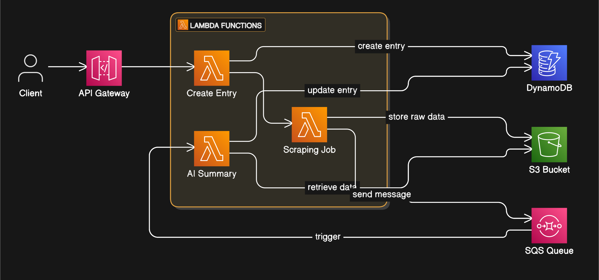

# Serverless Scraper - Golang, AWS, Terraform, Docker



## Overview

This project is a serverless problem scraper built with Golang, designed to be deployed on AWS using Terraform, AWS CLI, and Docker. It attempts to leverage the power of AWS Lambda, API Gateway, DynamoDB, S3, and SQS to create a scalable, event-driven, and cost-effective scraping solution. It's also my first time building anything in the cloud.

The scraper is composed of three main components:

1.  **API:** Handles incoming requests via API Gateway, creating or updating entries in DynamoDB, and triggering the scraping job.
2.  **Scraper:** Performs the web scraping operation, stores the raw data in an S3 bucket, and sends a message to an SQS queue to trigger the analysis function.
3.  **AI Summary:** Retrieves the raw data from S3, performs analysis (ChatGPT for summarization), and potentially stores the results back in DynamoDB.

## Architecture

- **AWS Lambda:** Executes the core logic of the application in a serverless manner.
- **API Gateway:** Provides an HTTP endpoint for interacting with the scraper.
- **DynamoDB:** Stores metadata about scraping jobs and potentially the processed results.
- **S3:** Stores the raw scraped data.
- **SQS:** Facilitates asynchronous communication between the scraper and the analysis function.
- **Terraform:** Infrastructure as Code (IaC) tool used to define and provision the AWS resources.
- **AWS CLI:** Used for interacting with AWS services during deployment and configuration.
- **Docker:** Containerizes the Lambda functions for easy deployment and management.

## Why AWS and Lambda

- **Scalable:** Leverages the scalability of AWS Lambda to handle varying workloads.
- **Event-Driven:** Uses SQS events to trigger the analysis function, ensuring asynchronous processing.
- **Cost-Effective:** Pays only for the compute time consumed by Lambda functions and other service usage.
- **Modular:** Separates concerns into distinct Lambda functions for easier maintenance and updates.
- **Deployment:** Uses Terraform and Docker for streamlined deployment and infrastructure management.

## Prerequisites

Before you begin cloning the repo, ensure you have met the following requirements:

- **AWS Account:** You need an AWS account with appropriate permissions to create and manage the required services.
- **AWS CLI:** Install and configure the AWS CLI. See [AWS CLI Installation Guide](https://docs.aws.amazon.com/cli/latest/userguide/getting-started-install.html).
- **Terraform:** Install Terraform. See [Terraform Installation Guide](https://developer.hashicorp.com/terraform/tutorials/aws-get-started/install-cli).
- **Docker:** Install Docker Desktop. See [Docker Desktop Installation Guide](https://docs.docker.com/get-docker/).
- **Golang:** Install Go programming language. See [Go Installation Guide](https://go.dev/doc/install).

## Getting Started

1.  **Clone the repository:**

    ```bash
    git clone https://github.com/kerosiinikone/serverless-scraper.git
    cd serverless-scraper
    ```

2.  **Configure AWS Credentials:**

    Make sure your AWS CLI is configured with the correct credentials and default region. You can configure it using:

    ```bash
    aws configure
    ```

3.  **Create a new ECR repo:**

    Create a new repo in your AWS ECR. Use the repo name as `PROJECT_NAME` in the Makefile and Terraform setup. Remember to also login locally (view push commands).

4.  **Build the Docker Images (Makefile):**

    Build the Docker images for each Lambda function with the provided Makefile:

    ```bash
    make PROJECT_NAME=foo AWS_ACCOUNT=bar
    ```

5.  **Deploy with Terraform:**

    Initialize Terraform and deploy the infrastructure:

    ```bash
    terraform init
    terraform apply
    ```

    Terraform will prompt you to confirm the deployment. Review the resources that will be created and type `yes` to proceed.

6.  **Test the API:**
    After successful deployment, you can test the API using the API Gateway endpoint URL provided in the Terraform output. You can use tools like `curl` or Postman to send requests.

    ```bash
    curl -X POST <YOUR_API_GATEWAY_ENDPOINT_URL> -d '{"client_id": "1", "subreddit": "golang"}'
    ```

    Replace `<YOUR_API_GATEWAY_ENDPOINT_URL>` with the actual endpoint URL and adjust the request body as needed.

## Web Scraper

- **Scraping Logic:** Right now the scraper is built to scrape Reddit as this was the easiest option to begin with. New scraping implementations can be added as long as they implement the `type Scraper interface`.

## Deployment

The project is designed to be deployed on AWS using Terraform. The `modules` directory contains the necessary configuration files. You can customize the infrastructure by modifying these files.

## TODO

Custom logger, proper configuration
